# MemWault — Personal Memory Preservation & Archiving

<p align="center">
  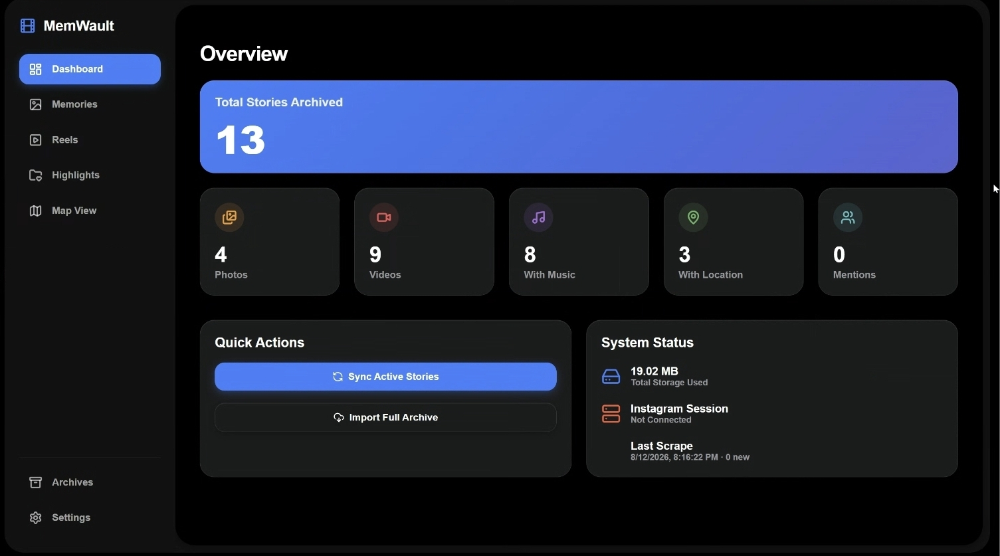
</p>

<p align="center">
  <b>MemWault is a private, self-hosted digital archive for preserving, organizing, and replaying personal social-media memories. It turns ephemeral Instagram Stories, Reels, and their surrounding context—music, locations, tags, engagement, and journals—into a searchable, self-hosted personal memory archive.</b>
</p>

<p align="center">
  
  
  
  
</p>

<p align="center">
  <b>Self-Hosted • Local-First • Progressive Web App (PWA)</b>
</p>

---

## Table of Contents

- [Why MemWault?](#why-memwault)
- [Key Features](#key-features)
- [Engineering Highlights](#engineering-highlights)
- [What MemWault Preserves](#what-memwault-preserves)
- [Visual Tour](#visual-tour)
- [Changelog & Evolution](#changelog--evolution)
- [Developer Documentation](#-developer-documentation)
  - [Architecture & System Flow](#architecture--system-flow)
  - [Memory Object Model](#memory-object-model)
  - [Authentication & Security](#authentication--security)
  - [Storage & Media Model](#storage--media-model)
  - [Repository Structure](#repository-structure)
  - [Quickstart & Development](#quickstart--development)
  - [Docker Setup](#docker-setup)
  - [Configuration](#configuration)
  - [Current Limitations](#current-limitations)
  - [Design Decisions](#design-decisions)
  - [License](#license)

---

## Why MemWault?

> **Social media is ephemeral. Your memories shouldn't be.**

Instagram stores the temporary interface around your memories, but it doesn't give you a permanent, independent memory archive with its full context preserved. MemWault exists to make that archive yours.

- 🔒 **Data Ownership & Portability:** Maintain an independent local copy of your memory history free from cloud lock-in.
- 📜 **Context Preservation:** Capture not just the photo or video, but the surrounding narrative—music, locations, tags, engagement, and personal journal notes.
- 🛡️ **Account Safety & Privacy:** Scraper workflows operate locally under strict rate limits, explicitly avoiding volatile endpoints to protect your account.
- 🏛️ **Preservation Over Reinterpretation:** Media is stored in its authentic raw format, with metadata layered around it rather than altering the archived Story itself.

---

## Key Features

- 🔄 **Smart Media Segregation:** Automatically distinguishes between actual personal Stories and Reels reposted to Stories as a distinct archival classification problem.
- 📊 **Archived Engagement Metrics:** Preserve Story viewer counts and like counts captured at archival time alongside media and metadata.
- 📝 **Sidecar Markdown Journaling:** Write rich notes auto-synced as human-readable `.md` files right next to `photo.jpg` on disk so your thoughts are never trapped inside a database.
- 🎒 **Portable Metadata & EXIF:** Option to embed archival context directly into media files so memories remain meaningful even outside MemWault.
- 📅 **Continuous Semantic Zoom Timeline:** Transition smoothly between **Years**, **Months**, and **Days** views using Framer Motion spring-based animations.
- 🗺️ **Spatial Story Map:** Explore your memories geographically on an interactive Leaflet map featuring spatial clustering and bounding-box search.
- 🎨 **Custom Highlight Albums:** Group your local stories into custom albums with dynamic 4-image grid covers, video thumbnails, and local cover uploads.
- 🎵 **iTunes Music Integration:** Embedded mini-player that streams 30-second audio previews for songs attached to your stories.

---

## Engineering Highlights

- ⚡ **Asynchronous FastAPI Backend:** SQLAlchemy 2.0 ORM with async connection pooling (`aiosqlite` / `asyncpg`).
- 🔄 **Distributed Ingestion Pipeline:** Redis + Celery worker queue for periodic background polling.
- 💾 **Hybrid Media Abstraction:** Local filesystem storage with `.md` sidecars or S3-compatible object storage (MinIO / AWS S3).
- 🔑 **Separated Authentication Domains:** JWT-based MemWault application authentication and locally persisted Instagram browser sessions.
- 📱 **Persistent UI Navigation:** React Router 7 outlet composition preserves page state across route transitions.

---

## What MemWault Preserves

MemWault treats a Story as a **structured memory object** rather than a simple media file:

```text
Single Archived Memory Object
├── 📷 Original Media Asset (Original .jpg photo or .mp4 video)
├── ⏱️ Story Timestamp      (UTC creation timestamp)
├── 💬 Caption & Text Content (Raw caption & text sticker content)
├── 🎨 Composition Manifest  (Visual layout state, sticker positioning & layers)
├── 🎵 Music Track         (Song title, artist name, and 30s preview URL)
├── 📍 Geolocation         (Named location venue & GPS coordinates)
├── 🏷️ User Mentions       (Tagged usernames)
├── 📈 Engagement Metrics  (Viewer Count & Story Like Count)
├── 📓 Sidecar Journal     (Human-authored Markdown .md file)
└── 🖼️ Highlight Metadata  (Album memberships & cover attributes)
```

---

## Visual Tour

> **MemWault is designed around the idea that an archive should be explored spatially and temporally—not simply browsed as a folder of files.**  
> **Zoom from years to months to days, jump through time with FastScrollbar, open a memory, inspect its metadata, journal it, view its location, or replay it as originally experienced.**

### 1. Dashboard & Continuous Timeline

<table align="center" width="100%">
  <tr>
    <td width="50%" align="center">
      <b>Dashboard & Analytics Overview</b><br/>
      <br/>
      <sub>Live stats, total story counts, storage consumption, and system status</sub>
    </td>
    <td width="50%" align="center">
      <b>Dedicated Reels Gallery</b><br/>
      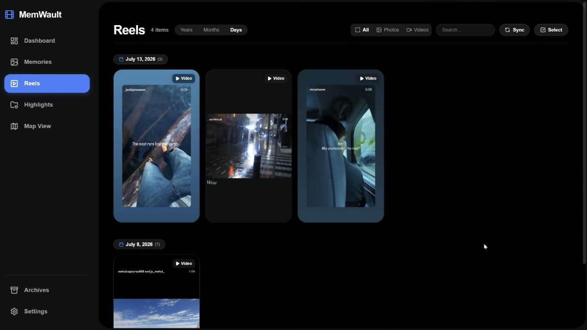<br/>
      <sub>Automatically segregated reels view with date headers and duration badges</sub>
    </td>
  </tr>
  <tr>
    <td width="50%" align="center">
      <b>Memories Timeline (Months Zoom)</b><br/>
      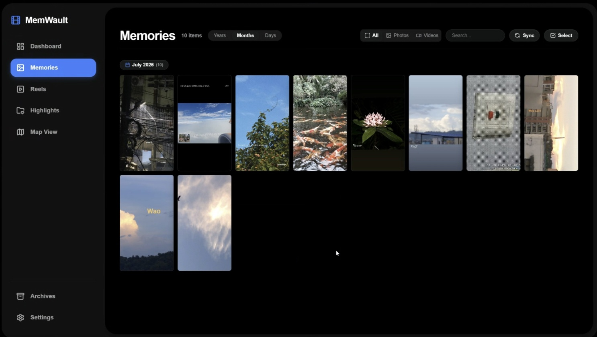<br/>
      <sub>Clean grid layout morphing with spring-based 3-pill zoom control</sub>
    </td>
    <td width="50%" align="center">
      <b>Memories Timeline (Days Zoom)</b><br/>
      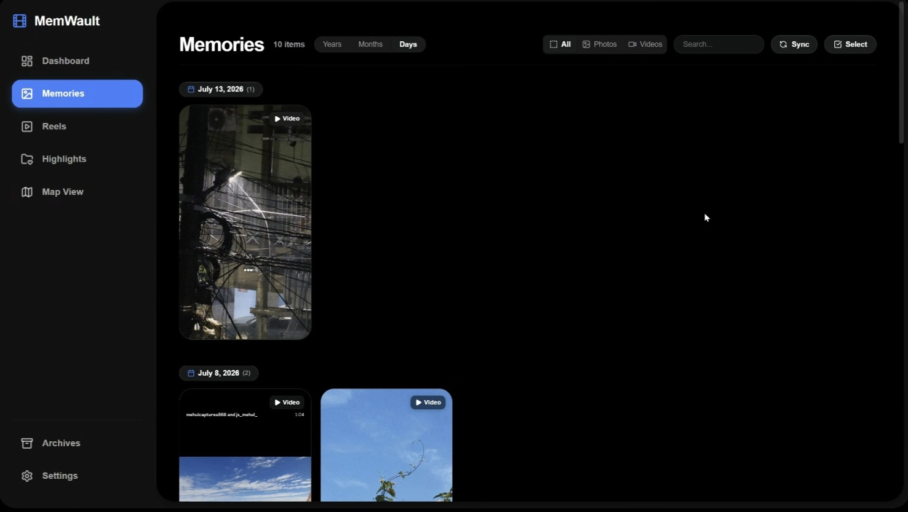<br/>
      <sub>Granular day-by-day view with high-res aspect ratio media cards</sub>
    </td>
  </tr>
</table>

---

### 2. Memory Studio & Sidecar Journaling

<table align="center" width="100%">
  <tr>
    <td width="50%" align="center">
      <b>Sidecar Markdown Journal Editor</b><br/>
      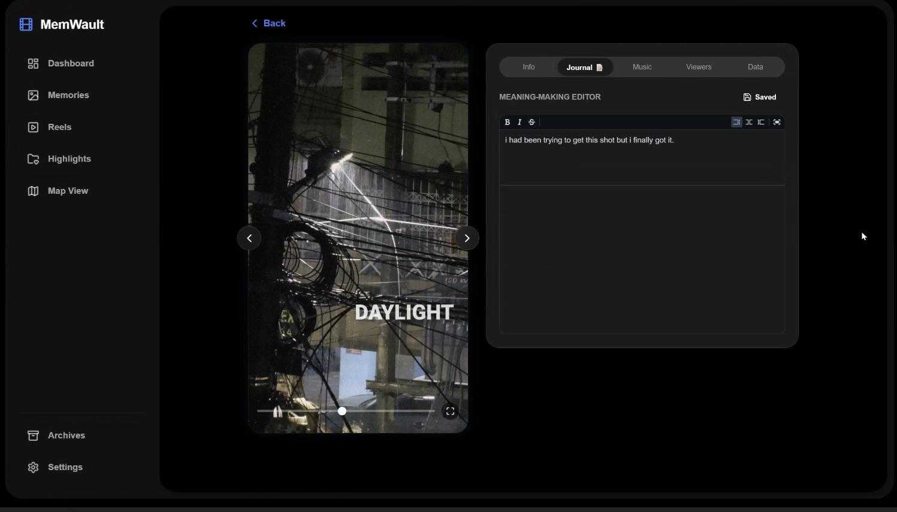<br/>
      <sub>Write rich markdown notes auto-synced as .md sidecar files next to media on disk</sub>
    </td>
    <td width="50%" align="center">
      <b>Memory Info & EXIF Metadata</b><br/>
      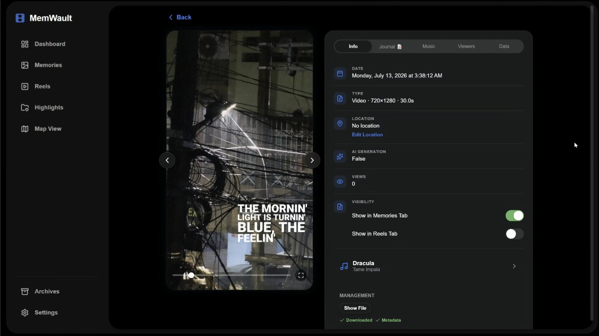<br/>
      <sub>Detailed EXIF metadata, capture timestamp, duration, and local file paths</sub>
    </td>
  </tr>
  <tr>
    <td width="50%" align="center">
      <b>iTunes Music Preview Player</b><br/>
      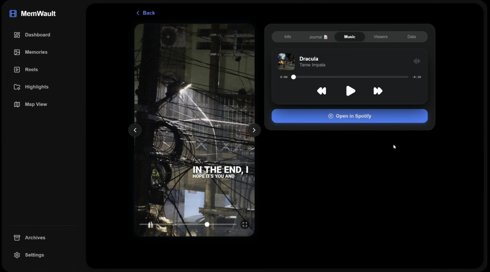<br/>
      <sub>Stream 30-second audio previews for soundtrack attached to your memory</sub>
    </td>
    <td width="50%" align="center">
      <b>Data Manifest & JSON Export</b><br/>
      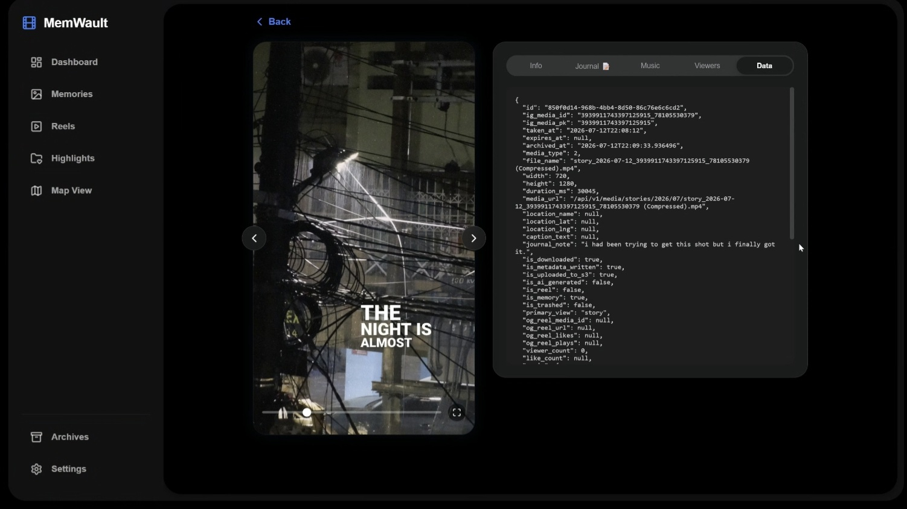<br/>
      <sub>Inspect raw JSON payload, story ID, and system data properties</sub>
    </td>
  </tr>
</table>

---

### 3. Custom Highlight Albums & Spatial Map

<table align="center" width="100%">
  <tr>
    <td width="50%" align="center">
      <b>Highlight Albums Gallery</b><br/>
      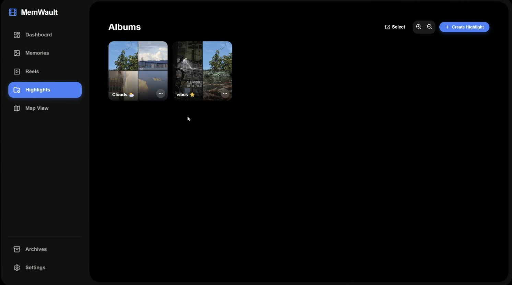<br/>
      <sub>Curated collections with dynamic 4-image grid covers and album titles</sub>
    </td>
    <td width="50%" align="center">
      <b>Highlight Player & Audio Stream</b><br/>
      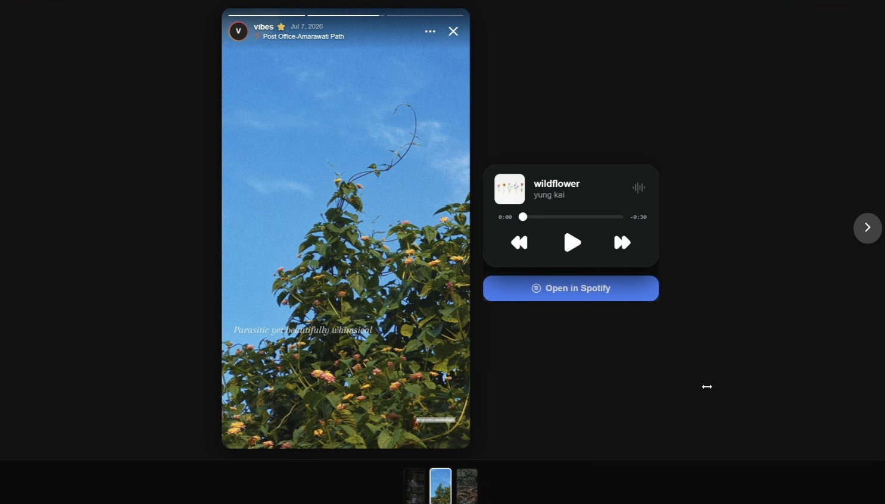<br/>
      <sub>Full-screen story playback inside custom highlight albums with music</sub>
    </td>
  </tr>
  <tr>
    <td width="50%" align="center">
      <b>Opened Highlight Collection</b><br/>
      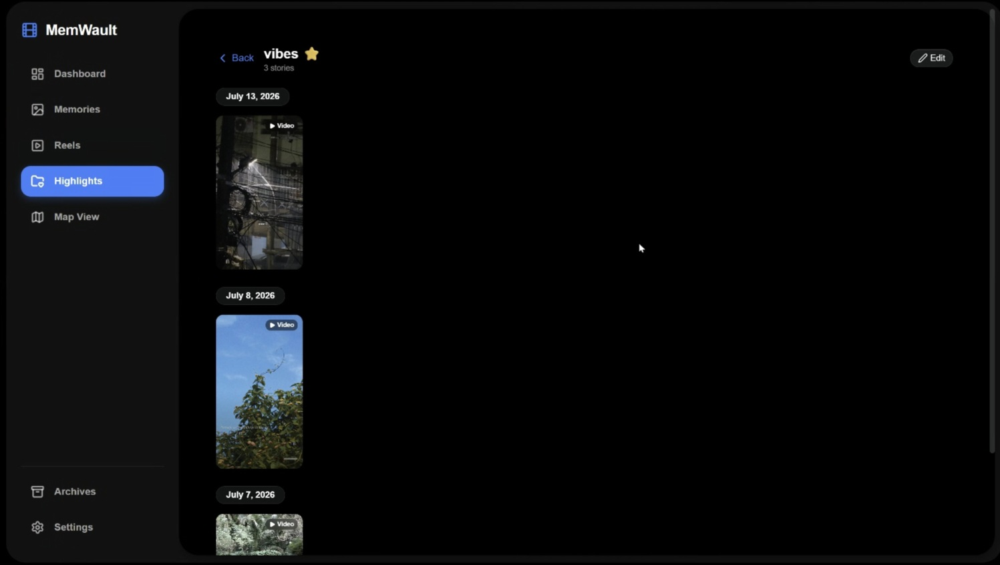<br/>
      <sub>Explore stories inside a specific highlight album</sub>
    </td>
    <td width="50%" align="center">
      <b>Album Options & Controls</b><br/>
      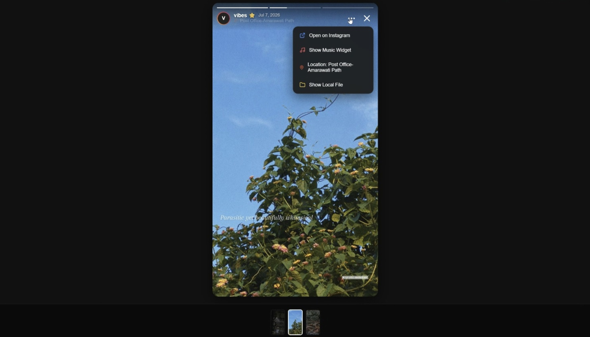<br/>
      <sub>Quick management actions, cover edits, and story additions</sub>
    </td>
  </tr>
  <tr>
    <td width="50%" align="center">
      <b>Spatial Map (Split Grid View)</b><br/>
      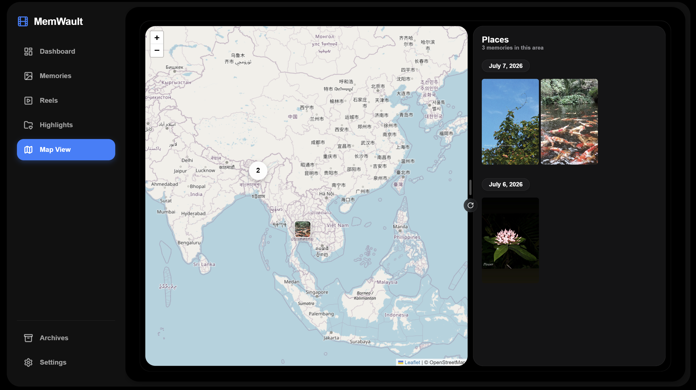<br/>
      <sub>Interactive spatial map with location pins and bento place cards</sub>
    </td>
    <td width="50%" align="center">
      <b>Spatial Map (Fullscreen View)</b><br/>
      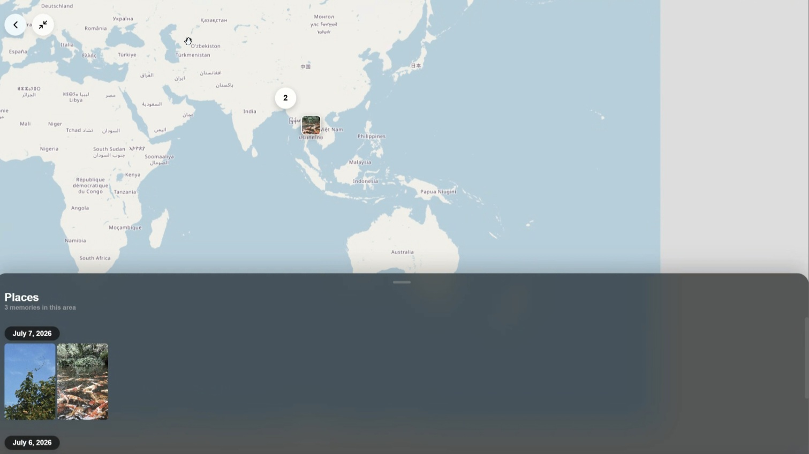<br/>
      <sub>Immersive full-screen geographic map view</sub>
    </td>
  </tr>
</table>

---

### 4. Settings, Maintenance & Archives

<table align="center" width="100%">
  <tr>
    <td width="50%" align="center">
      <b>Settings & Instagram Connection</b><br/>
      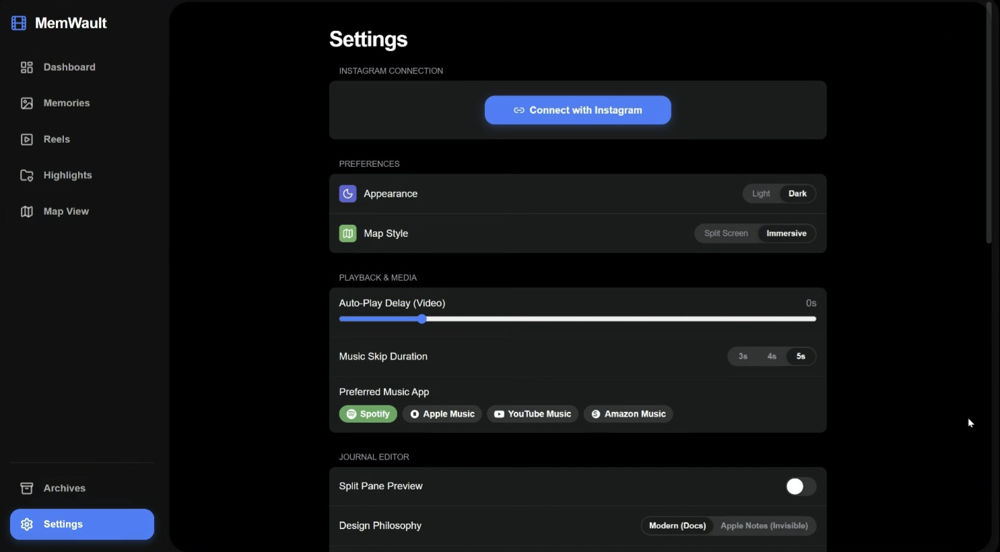<br/>
      <sub>Instagram session management, theme controls, and map style toggles</sub>
    </td>
    <td width="50%" align="center">
      <b>Scrape Logs & Maintenance</b><br/>
      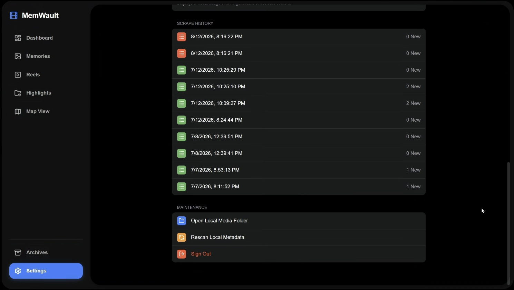<br/>
      <sub>Scrape execution history, local folder opener, and metadata rescanning</sub>
    </td>
  </tr>
  <tr>
    <td colspan="2" align="center">
      <b>Archives & Trash Recovery</b><br/>
      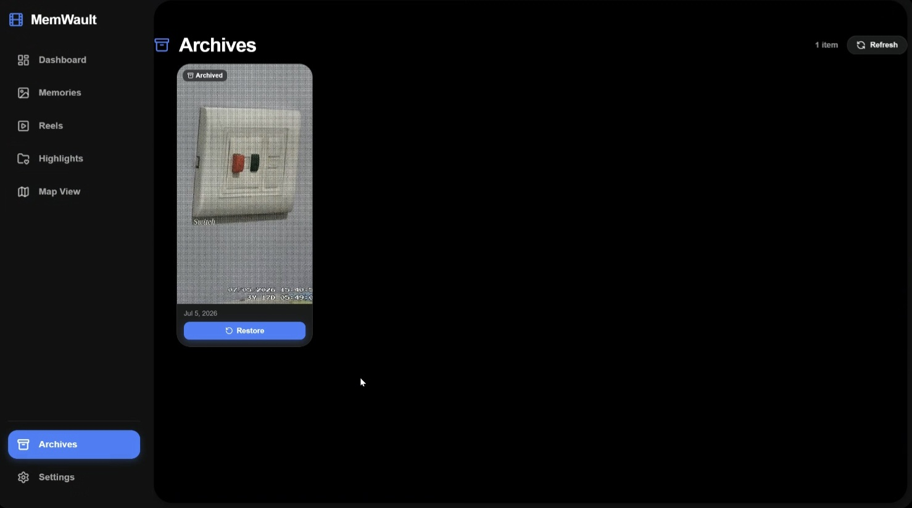<br/>
      <sub>Soft-delete trash manager for restoring or permanently deleting archived stories</sub>
    </td>
  </tr>
</table>

---

## Changelog & Evolution

### Version 2.5 — Architecture, Data Model & Documentation Update
- **Memory Object Model (MOM):** Standardized domain entity modeling for Stories, modeling them as rich multi-context memory objects.
- **Sub-Documentation Infrastructure (`/docs`):** Introduced dedicated in-depth documentation for system architecture, authentication flows, database models, S3/local storage, Instagram ingestion pipelines, REST APIs, and Docker deployments.
- **Code & Tech Stack Synchronization:** Synchronized documentation with codebase reality (React 19, React Router 7, `MEMWAULT_` environment variable prefix, Python 3.10+).
- **Containerized Infrastructure & Security:** Documented Docker Compose multi-container deployment (Postgres, Redis, MinIO, FastAPI, Celery) and local application security flow.

### Version 2.4 — Engagement, Privacy & UI
- **Archived Engagement Metrics:** Added permanent tracking for `viewer_count` and `like_count` in database schemas, scrapers, and metadata pipelines.
- **Account Safety Architecture:** Documented the decision to avoid scraping individual viewer lists to reduce account restriction risks.
- **EXIF/XMP Context Embedding:** Embedded captions, music, locations, and engagement directly into media metadata.
- **Unified Spring-Based Controls:** Standardized segmented controls and filter toggles across Timeline, Story Detail, Highlights, and Settings using Framer Motion.
- **Native Desktop Integration:** Windows Explorer and interactive Playwright browser sessions launch directly in native desktop windows when running on host OS.

### Version 2.3 — Sidecar Journal & Dynamic Highlights
- **Dynamic Highlight Grid:** Covers dynamically render as 4-Image Grids, 3-Image layouts, or vertical dual-views.
- **Contextual Sidecar Journaling:** Attach rich Markdown notes to any story, written as `.md` files directly next to your media files on disk.

### Version 2.2 — Archives & Search Update
- **Robust Archives (Trash):** Soft-delete and restore individual or bulk-selected stories.
- **Full-Text Backend Search:** Full-text SQL search engine across historical stories.

### Version 2.1 — Highlights & Albums
- **Highlights & Albums Integration:** Curate downloaded stories into custom Highlight Albums locally.
- **Media Sync & Pre-Signed URLs:** Dynamic S3 pre-signed URLs for decoupled storage environments.

### Version 2.0 — Timeline, Maps & Navigation
- **Smooth Page Transitions & FastScrollbar:** Drag through years of memories in milliseconds.
- **Interactive Spatial Map:** Initial release of spatial geographic marker clustering.

---

# 🛠️ Developer Documentation

## Architecture & System Flow

MemWault uses a React 19 PWA frontend backed by FastAPI, with PostgreSQL/SQLite persistence, configurable local/S3 media storage, and background processing through Celery/Redis.

```text
┌────────────────────────────────────────────────────────┐
│                   MemWault UI (PWA)                    │
│            React 19 + Vite + Framer Motion             │
└───────────────────────────┬────────────────────────────┘
                            │ REST API / HTTP
                            ▼
┌────────────────────────────────────────────────────────┐
│                   FastAPI Backend                      │
│             Async REST API & Web Handlers              │
└──────┬────────────────────┬────────────────────┬───────┘
       │                    │                    │
       ▼                    ▼                    ▼
┌─────────────┐     ┌──────────────┐     ┌──────────────┐
│  Database   │     │ Media Storage│     │ Redis Queue  │
│ SQLite / PG │     │ Local / S3   │     │ Task Broker  │
└──────▲──────┘     └──────────────┘     └──────┬───────┘
       │ Session                                │
       │ Cookies                                ▼
┌──────┴─────────────────────┐           ┌──────────────┐
│ Host Browser Session       │           │Celery Workers│
│ (Playwright / Chrome)      │           │Scraper Engine│
└──────────────┬─────────────┘           └──────┬───────┘
               │ Auth                           │ Ingestion
               ▼                                ▼
┌────────────────────────────────────────────────────────┐
│                 Instagram Mobile & Web                 │
└────────────────────────────────────────────────────────┘
```

📖 **Detailed Architecture Guide:** [`docs/architecture.md`](docs/architecture.md)

---

## Memory Object Model

The `Story` entity is the core archival object. Rather than treating media as a standalone file, MemWault models the Story as a media asset plus its temporal, spatial, compositional, social, engagement, and archival context.

📖 **Detailed Memory Model Guide:** [`docs/memory-model.md`](docs/memory-model.md)

---

## Authentication & Security

MemWault separates dashboard user access from Instagram session credentials:

```text
MemWault Application
├── 1. Local Browser Login (Playwright / Chrome)
│   └── Instagram session established locally
│   └── Session cookies persisted in DB
└──────► 2. Celery Scraper Engine (instagrapi)
         └── Fetches active stories & archived engagement
                 │
                 ▼
         3. FastAPI REST API (Bearer JWT Auth)
                 │
                 ▼
         4. React 19 Dashboard UI
```

- **Dashboard Auth:** FastAPI issues signed JSON Web Tokens (JWT) stored in `localStorage`. Passwords are salt-hashed using `bcrypt`.
- **Scraper Safety:** MemWault deliberately avoids automated individual viewer-list retrieval to reduce account risk. Legacy `StoryViewer` schemas and endpoints remain solely for compatibility with older historical archives.

📖 **Detailed Security Guide:** [`docs/authentication.md`](docs/authentication.md)  
📖 **Detailed Instagram Ingestion Guide:** [`docs/instagram.md`](docs/instagram.md)

---

## Storage & Media Model

MemWault keeps your archive under your control, supporting local and self-controlled storage configurations:

- **Local / Self-Hosted:** SQLite / PostgreSQL database + local drive filesystem (`media/<user_id>/<year>/<month>/<story_id>.jpg`) and `.md` sidecars.
- **Self-Controlled Object Storage:** MinIO container.
- **Remote Object Storage:** Private AWS S3 bucket.

📖 **Detailed Storage Guide:** [`docs/storage.md`](docs/storage.md)  
📖 **Detailed Metadata Guide:** [`docs/metadata.md`](docs/metadata.md)

---

## Repository Structure

```text
MemWault/
├── techstack/
│   ├── backend/           # FastAPI backend server & Celery background workers
│   │   ├── app/
│   │   │   ├── api/       # REST API endpoints (Auth, Stories, Storage)
│   │   │   ├── scraper/   # Instagram browser login & scraper engine
│   │   │   └── models.py  # SQLAlchemy database schemas
│   │   └── requirements.txt
│   └── frontend/          # React 19 + Vite PWA frontend
│       ├── src/
│       │   ├── components/# Framer Motion UI components (FastScrollbar, StoryCard)
│       │   ├── pages/     # Timeline, StoryDetail, MapView, Settings, Archives
│       │   └── services/  # API service client
│       └── package.json
├── docs/                  # In-depth technical & architectural documentation
│   ├── architecture.md
│   ├── authentication.md
│   ├── memory-model.md
│   ├── instagram.md
│   ├── api.md
│   ├── deployment.md
│   ├── storage.md
│   ├── metadata.md
│   └── configuration.md
├── screenshots/           # HD UI screenshots showcase
├── removed_features.md    # Internal design history & rationale
└── README.md
```

---

## Quickstart & Development

### 1. Prerequisites
- Python 3.10+
- Node.js 18+
- Redis (For Celery background worker tasks)

### 2. Backend Setup
```bash
cd techstack/backend
python -m venv venv

# Activate Virtual Environment (Windows)
.\venv\Scripts\activate

# Install Dependencies & Start FastAPI Server
pip install -r requirements.txt
python -m uvicorn app.main:app --reload --port 8000
```

### 3. Background Worker Setup (In a separate terminal)
```bash
cd techstack/backend
.\venv\Scripts\activate
celery -A app.worker worker --loglevel=info
```

### 4. Frontend Setup
```bash
cd techstack/frontend
npm install
npm run dev
```

Open **`http://localhost:5173`** in your browser.

---

## Docker Setup

Launch the complete containerized stack (PostgreSQL, Redis, MinIO, FastAPI, Celery Workers, Celery Beat, and Nginx React 19 PWA):

```bash
cd techstack
docker compose up -d --build
```

📖 **Detailed Deployment Guide:** [`docs/deployment.md`](docs/deployment.md)

---

## Configuration

MemWault is configured using environment variables with the `MEMWAULT_` prefix.

| Variable | Default Value | Description |
| :--- | :--- | :--- |
| `MEMWAULT_DATABASE_TYPE` | `sqlite` | Database engine (`sqlite` or `postgres`) |
| `MEMWAULT_POSTGRES_HOST` | `localhost` | PostgreSQL host address |
| `MEMWAULT_REDIS_URL` | `redis://localhost:6379/0` | Redis broker URI for Celery tasks |
| `MEMWAULT_STORAGE_TYPE` | `local` | Storage mode (`local` or `s3`) |
| `MEMWAULT_STORAGE_LOCAL_DIR` | `./data/media` | Host filesystem path for media storage |
| `MEMWAULT_SECRET_KEY` | *[Change in Prod]* | Secret key for JWT signing |

📖 **Detailed Configuration Guide:** [`docs/configuration.md`](docs/configuration.md)  
📖 **REST API Reference:** [`docs/api.md`](docs/api.md)

---

## Current Limitations

- **Volatile Endpoints:** Instagram integration depends on private endpoints and rate limits; changes by Instagram may require session updates.
- **Desktop Integration:** Native file manager ("Show in Folder") and Playwright browser popups require the backend to run on the host OS; containerized environments (Docker) cannot directly launch host desktop applications.

---

## Design Decisions

Some features have been deliberately removed or avoided to preserve archival authenticity, reduce account risk, or prevent unnecessary software complexity.

📖 **See [`removed_features.md`](removed_features.md) for full design rationale regarding removed timeline date filters and custom music player overlays.**

---

## License

Licensed under the **PolyForm Noncommercial License 1.0.0**.

Copyright (c) 2026 **Mehul Jain (mehuljain866)**. All rights reserved.

> You may obtain a copy of the License at [https://polyformproject.org/licenses/noncommercial/1.0.0](https://polyformproject.org/licenses/noncommercial/1.0.0).  
> Personal use, research, and noncommercial educational use are permitted under the PolyForm Noncommercial License.
